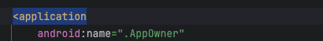
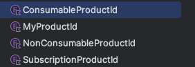
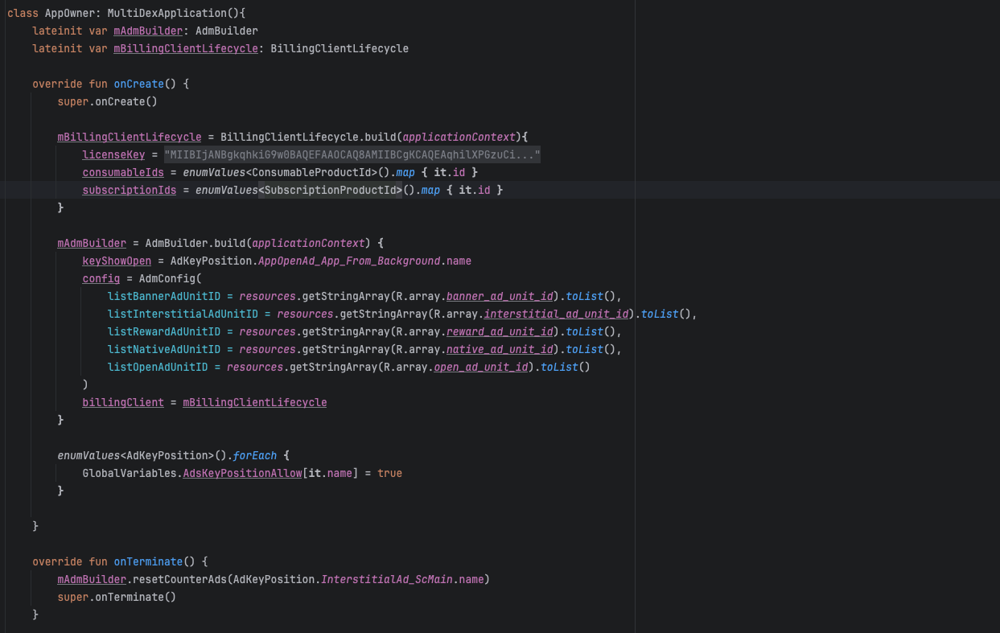

# GS_AD

## Installation
#### repositories
Vào mục setting.gradle.kts. Copy:
```gradle
maven { url 'https://jitpack.io' }
```
Như hình:


#### dependencies
Cài thư viện
```gradle
implementation("com.github.ongan1234:gs_ad:1.0.4")
```
Thêm các thư viện
```gradle
implementation ("com.google.android.gms:play-services-ads:23.5.0")
implementation ("com.google.android.ump:user-messaging-platform:3.1.0")

implementation ("androidx.multidex:multidex:2.0.1")
implementation ("com.github.eriffanani:ContentLoader:1.2.0")
implementation ("com.facebook.shimmer:shimmer:0.5.0@aar")
```

## AndroidManifest
Copy các thẻ meta vào trong application
```manifest
<uses-permission android: name="android.permission.ACCESS_NETWORK_STATE" />
<uses-permission android: name="android.permission.INTERNET" />

<meta-data
     android:name="com.google.android.gms.ads.flag.OPTIMIZE_INITIALIZATION"
     android:value="true" />
<meta-data
     android:name="com.google.android.gms.ads.flag.OPTIMIZE_AD_LOADING"
     android:value="true" />
<meta-data
     android:name="com.google.android.gms.ads.AD_MANAGER_APP"
     android:value="true" />
<meta-data
     android:name="com.google.android.gms.ads.APPLICATION_ID"
     android:value="@string/app_ad_id" />
<meta-data
     android:name="com.google.android.gms.ads.flag.NATIVE_AD_DEBUGGER_ENABLED"
     android:value="false" />
```

## Cách sử dụng
Tạo 1 file **AdKeyPosition.kt** với cú pháp (tên Ad_Sc màn hình) màn hình có thể tên Activity hoặc Fragment ví dụ:
```
enum class AdKeyPosition {
    AppOpenAd_App_From_Background,

    BannerAd_ScMain,
    NativeAd_ScMain,
    NativeAd_ScMain2,
    InterstitialAd_ScMain,
    RewardAd_ScMain,
    InterstitialAd_ScMain2,
    RewardAd_ScMain2,

    NativeAd_ScOnBoard_1,
    NativeAd_ScOnBoard_2,
    NativeAd_ScOnBoard_3,
    NativeAd_ScOnBoard_4
}
```
Tạo 1 **AppOwner.kt** và thêm vào **AndroidManifest.xml** như hình:



Sử dụng **AdmManager** trong các Activity
```kotlin
private val mAdmManager: AdmManager get() { return (application as AppOwner).mAdmBuilder.getActivity(this) }
```

Nếu là Activity main ko finish thì khởi tạo như sau
```kotlin
private val mAdmManager: AdmManager get() { return (application as AppOwner).mAdmBuilder.isMainActivity(this) }
```

Phải khởi tạo UMP trước khi sử dụng Ad, nên dùng ở trong màn Splash
```kotlin
mAdmManager.initUMP(gatherConsentFinished = {
     //TODO
})
```

### BannerAd
Gọi Load Ad:
```kotlin
mAdmManager.loadBannerAd(-1, AdKeyPosition.BannerAd_ScMain.name, binding.bannerView)
            .setListener(object : OnAdmListener {
                override fun onAdLoaded(typeAds: TYPE_ADS, keyPosition: String) {
                    super.onAdLoaded(typeAds, keyPosition)
                }
            })
})
```

BannerAd Lifecycle
```kotlin
override fun onResume() {
     super.onResume()
     mAdmManager.resumeBannerAdView()
}

override fun onPause() {
     super.onPause()
     mAdmManager.pauseBannerAdView()
}

```

### NativeAd
Gọi Load Ad:
```kotlin
mAdmManager.loadNativeAd(-1, AdKeyPosition.NativeAd_ScMain2.name, binding.nativeAdContainerView, R.layout.layout_native_ad_origin,
     isFullScreen = false
)
```
Gọi Preload và dùng ApplyView:
```kotlin
mAdmManager.preloadNativeAd(-1, AdKeyPosition.NativeAd_ScOnBoard_1.name, isFullScreen = false)
```
```kotlin
mAdmManager.applyNativeAdView(AdKeyPosition.NativeAd_ScOnBoard_1.name, adContainer, R.layout.layout_native_ad_full)
```

### InterstitialAd
```kotlin
mAdmManager.showInterstitialAd(AdKeyPosition.InterstitialAd_ScMain.name)
     .setListener(object : OnAdmListener {
          override fun onAdClosed(typeAds: TYPE_ADS, keyPosition: String) {
               super.onAdClosed(typeAds, keyPosition)
               //TODO
          }
     })
```

Sử dụng ***countToShowInterstitialAd*** với trường hợp đếm tương tác nhiêu nút bấm trên 1 màn hình, với firstShowAd là số lần phải tương tác các nút bấm trong lần đầu tiên để show ad, loopShowAd là số lần khi tương tác lại các nút bấm đó để show lại ad :
```kotlin
mAdmManager.countToShowInterstitialAd(
                AdKeyPosition.InterstitialAd_ScMain_CountShowAd.name,
                firstShowAd = 3,
                loopShowAd = 2
            )
```
Muốn reset lại số lần thì sử dụng:
```kotlin
     mAdmBuilder.resetCounterAds(AdKeyPosition.InterstitialAd_ScMain.name)
```

### RewardAd
```kotlin
mAdmManager.showRewardAd(AdKeyPosition.RewardAd_ScMain.name)
     .setListener(object : OnAdmListener {
          override fun onAdClosed(typeAds: TYPE_ADS, keyPosition: String) {
               super.onAdClosed(typeAds, keyPosition)
               //TODO
          }
     })
```

### OpenAd
Để xuất hiện OpenAd thì sử dụng ***GlobalVariables.canShowOpenAd = true***. ví dụ:
```kotlin
override fun onStart() {
     super.onStart()
     GlobalVariables.canShowOpenAd = true
}
```

OpenAd ở các màn **Splash, Subscription, OnBoard** ko nên hiện thì để ***GlobalVariables.canShowOpenAd = false***

### Lưu ý
Sử dụng setListener ở onCreate 1 activity như sau:
```kotlin
override fun onCreate(savedInstanceState: Bundle?) {
        super.onCreate(savedInstanceState)
        mAdmManager.setListener(this)
}
```

Dùng ***removeListener*** trước finish 1 activity như sau:
```kotlin
     mAdmManager
            .destroyAdByKeyPosition(TYPE_ADS.NativeAd, AdKeyPosition.NativeAd_ScMain2.name)
            .removeListener()
     finish()
```

Đối với activity main thì để trong ***onDestroy*** như sau:
```kotlin
     override fun onDestroy() {
        mAdmManager
            .destroyAdByKeyPosition(TYPE_ADS.BannerAd, AdKeyPosition.BannerAd_ScMain.name)
            .destroyAdByKeyPosition(TYPE_ADS.NativeAd, AdKeyPosition.NativeAd_ScMain.name)
            .removeListener()
            .removeMainActivity()
        super.onDestroy()
    }
```

# Sub
## Cách sử dụng
Tạo các 4 file Product Id như hình:


Tạo 1 **AppOwner.kt** như hình:


Khởi tạo ***BillingClientLifecycle*** trong các activity
```kotlin
private val mBillingClientLifecycle: BillingClientLifecycle? get() { return  (application as AppOwner).mBillingClientLifecycle ?: null}
```

Gọi ***setListener*** trong onCreate ở các activity như sau:
```kotlin
mBillingClientLifecycle?.setListener(this, object : OnBillingListener {
            override fun onPurchasedProductsFetched(purchaseInfos: List<PurchaseInfo>) {
                super.onPurchasedProductsFetched(purchaseInfos)
            }
        })
```
Dùng ***removeListener*** trước finish 1 activity như sau:
```kotlin
     mBillingClientLifecycle?.removeListener(this)
     finish()
```
Đối với activity main như sau:
```kotlin
override fun onDestroy() {
     mBillingClientLifecycle?.removeListener(this)
     super.onDestroy()
}
```

Lấy giá item Sub và iap như sau:
```kotlin
mBillingClientLifecycle.getSubscriptionPrice(SubscriptionProductId.Weekly.id)
```
```kotlin
mBillingClientLifecycle.getIAPPrice(ConsumableProductId.Lifetime.id)
```

Mua gói Sub và Lifetime sử dụng như sau:
```kotlin
mBillingClientLifecycle.subscribe(this@SubscriptionActivity, ConsumableProductId.Lifetime.id)
```
```kotlin
mBillingClientLifecycle.purchaseLifetime(this@SubscriptionActivity, SubscriptionProductId.Weekly.id)
```

Sử dụng ***fetchSubPurchasedProducts*** để check Sub có tồn tại ko
```kotlin
mBillingClientLifecycle?.fetchSubPurchasedProducts()
```

## Tải bản mẫu về xem
https://github.com/ongan1234/gs_ad/archive/refs/heads/main.zip

