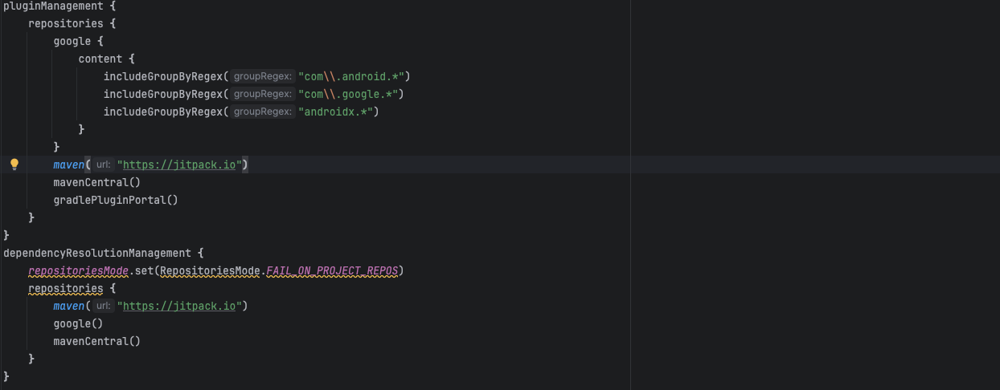
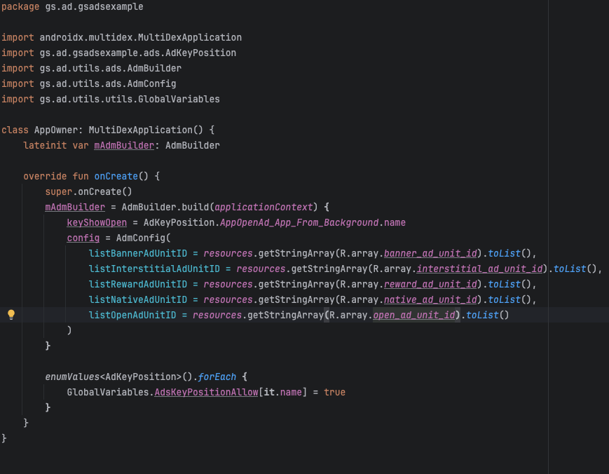

# GS_AD

## Installation
#### repositories
Vào mục setting.gradle.kts. Copy:
```gradle
maven { url 'https://jitpack.io' }
```
Như hình:



#### dependencies
Cài thư viện
```gradle
implementation("com.github.ongan1234:gs_ad:1.0.1")
```
Thêm các thư viện
```gradle
implementation ("com.google.android.gms:play-services-ads:23.5.0")
implementation ("com.google.android.ump:user-messaging-platform:3.1.0")

implementation ("androidx.multidex:multidex:2.0.1")
implementation ("com.github.eriffanani:ContentLoader:1.2.0")
implementation ("com.facebook.shimmer:shimmer:0.5.0@aar")
```

## AndroidManifest
Copy các thẻ meta vào trong application
```manifest
<uses-permission android: name="android.permission.ACCESS_NETWORK_STATE" />
<uses-permission android: name="android.permission.INTERNET" />

<meta-data
     android:name="com.google.android.gms.ads.flag.OPTIMIZE_INITIALIZATION"
     android:value="true" />
<meta-data
     android:name="com.google.android.gms.ads.flag.OPTIMIZE_AD_LOADING"
     android:value="true" />
<meta-data
     android:name="com.google.android.gms.ads.AD_MANAGER_APP"
     android:value="true" />
<meta-data
     android:name="com.google.android.gms.ads.APPLICATION_ID"
     android:value="@string/app_ad_id" />
<meta-data
     android:name="com.google.android.gms.ads.flag.NATIVE_AD_DEBUGGER_ENABLED"
     android:value="false" />
```

## Cách sử dụng
Tạo 1 file AdKeyPosition với cú pháp (tên Ad_Sc màn hình) màn hình có thể tên Activity hoặc Fragment ví dụ:
```
enum class AdKeyPosition {
    AppOpenAd_App_From_Background,

    BannerAd_ScMain,
    NativeAd_ScMain,
    NativeAd_ScMain2,
    InterstitialAd_ScMain,
    RewardAd_ScMain,
    InterstitialAd_ScMain2,
    RewardAd_ScMain2,

    NativeAd_ScOnBoard_1,
    NativeAd_ScOnBoard_2,
    NativeAd_ScOnBoard_3,
    NativeAd_ScOnBoard_4
}
```
Tạo 1 AppOwner.kt như hình:


Sử dụng AdmManager trong các Activity
```kotlin
private val mAdmManager: AdmManager get() { return (application as AppOwner).mAdmBuilder.getActivity(this)}
```

Phải khởi tạo UMP trước khi sử dụng Ad, nên dùng ở trong màn Splash
```kotlin
mAdmManager.initUMP(gatherConsentFinished = {
     //TODO
})
```

### BannerAd
Gọi Load Ad:
```kotlin
mAdmManager.loadBannerAd(0, AdKeyPosition.BannerAd_ScMain.name, binding.bannerView)
            .setListener(object : OnAdmListener {
                override fun onAdLoaded(typeAds: TYPE_ADS, keyPosition: String) {
                    super.onAdLoaded(typeAds, keyPosition)
                }
            })
})
```

BannerAd Lifecycle
```kotlin
override fun onResume() {
     super.onResume()
     mAdmManager.resumeBannerAdView()
}

override fun onPause() {
     super.onPause()
     mAdmManager.pauseBannerAdView()
}

override fun onDestroy() {
     mAdmManager.destroyAdByKeyPosition(TYPE_ADS.BannerAd, AdKeyPosition.BannerAd_ScMain.name)
     mAdmManager.removeListener()
     super.onDestroy()
}
```

### NativeAd
Gọi Load Ad:
```kotlin
mAdmManager.loadNativeAd(0, AdKeyPosition.NativeAd_ScMain2.name, binding.nativeAdContainerView, R.layout.layout_native_ad_origin,
     isFullScreen = false
)
```

NativeAd Lifecycle
```kotlin
override fun onDestroy() {
     mAdmManager.destroyAdByKeyPosition(TYPE_ADS.NativeAd, AdKeyPosition.NativeAd_ScMain2.name)
     mAdmManager.removeListener()
     super.onDestroy()
}
```

### InterstitialAd
```kotlin
mAdmManager.showInterstitialAd(AdKeyPosition.InterstitialAd_ScMain.name)
     .setListener(object : OnAdmListener {
          override fun onAdClosed(typeAds: TYPE_ADS, keyPosition: String) {
               super.onAdClosed(typeAds, keyPosition)
               //TODO
          }
     })
```

### RewardAd
```kotlin
mAdmManager.showRewardAd(AdKeyPosition.RewardAd_ScMain.name)
     .setListener(object : OnAdmListener {
          override fun onAdClosed(typeAds: TYPE_ADS, keyPosition: String) {
               super.onAdClosed(typeAds, keyPosition)
               //TODO
          }
     })
```

### OpenAd
Để xuất hiện OpenAd thì sử dụng ***GlobalVariables.canShowOpenAd = true***. ví dụ:
```kotlin
override fun onStart() {
     super.onStart()
     GlobalVariables.canShowOpenAd = true
}
```


OpenAd ở các màn **Splash, Subscription, OnBoard** ko nên hiện thì để ***GlobalVariables.canShowOpenAd = false***


### Lưu ý
Về setListener có thể dùng ***mAdmManager.setListener(this)*** hoặc dùng như trên và sau khi finish Activity thì phải ***removeListener*** như sau:
```kotlin
override fun onDestroy() {
     mAdmManager.removeListener()
     super.onDestroy()
}
```


